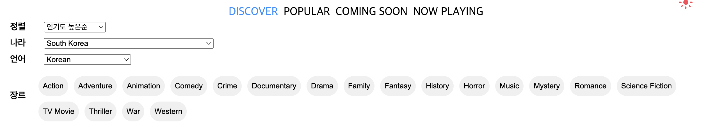

## 배포

[배포 사이트](https://dam-movies.vercel.app/)<br/>

## 프로젝트 상세 구현 내용

### query parameter를 사용한 영화리스트 필터 구현 (추가 구현 중)



- 주소링크 공유를 통해 사용자가 필터 적용된 영화리스트 및 상세 페이지를 접근할 수 있게 query string으로 필터 구현
- 특정 페이지에서 노출될 필요없는 query string 값은 url 공개하지않음
- 중첩객체를 변환 시키지 못하는 URLSearchParams를 위하여 queryString 관련 유틸리티함수 생성
  - 현재 중첩객체 필터 미적용(추후, 날짜 및 평점으로 적용 예정)
  - 필터가 적용되지않는 영화 리스트일 경우 사용자 선호언어 기반으로 렌더링
- `window.navigator.language` (사용자 선호언어)를 기반으로 필터의 language와 region의 초기값으로 설정

- 필터예시
  |sorted_by (인기도 높은순) <br/> region (일본) <br/> language (한국어) <br/> genre (Adventure, Animation)|sorted_by (인기도 높은순) <br/> region (일본) <br/> language (일본어) <br/> genre (Adventure, Animation)|
  |-|-|
  |||

### 이미지 최적화

- 상세 영화 정보 모달에 보여질 배너 이미지 로드 시간을 줄이기위해, 데이터 페칭시에 이미지도 함께 호출
  - 이미지 프리로드 : 로딩 지연 시간을 염려하여 await 을 사용하지 않고 브라우저 캐싱을 시도
- 블러 효과 적용 : 배너 이미지가 완전히 로드될 때까지 블러 효과를 적용하여 부드러운 사용자 경험을 제공

### 커스텀 에러와 에러 바운더리를 이용한 에러 핸들링

- custom Error 생성
  - axios interceptor 에서 에러 응답에 대하여 공통 에러 처리
  - 이를 캐치하는 ApiErrorBoundary 를 tanstack-query의 ErrorQueryResetBoundary 를 결합하여 구현

### 영화리스트 무한스크롤

- intersection observer API 와 tanstack-query의 useSuspenseInfiniteQuery 결합하여 구현
- 버튼 클릭시 스크롤 최상단으로 이동하는 탑버튼 추가

### 다크모드

- `useSyncExternalStore`을 활용하여 외부 저장소인 로컬스토리지에 사용자가 선택한 다크모드값을 저장하고 관리
  |다크모드 | 라이트 모드|
  |-|-|
  ||

### query parameter과 Optional URL 파라미터를 사용하여 movie list type을 처리

- `/:movieListType?/movie/:movieId`
  |url |movie list type |
  |-|-|
  |`/`|popular|
  |`/coming-soon`|upcomming|
  |`/now-playing` | now_playing|

- 일관성을 위하여 필터가 적용되는 discover 페이지도 동일한 구조로 설계

## 추후 구현 계획 및 하고싶은 항목

- 필터 기능 중, 중첩객체인 "날짜", "평점"필터 추가
- 필터 디자인
- 에러페이지 디자인
- 스켈레톤 컴포넌트 디자인
- route path 구조 변경
- (고려) 직접 구현한 query string 유틸리티함수를 라이브러리로 마이그레이션

## 기술스택

- React (vite)
- TypeScript
- Styled-components
- tanstack-query
- framer-motion

## 프로젝트 실행 방법

1. Clone the repo

```javascript
$ git clone https://github.com/j2h30728/dam-movies.git
```

2. Install NPM packages

```javascript
$ npm install
```

3. Getting Started

```javascript
$ npm run dev
```

<br/>
